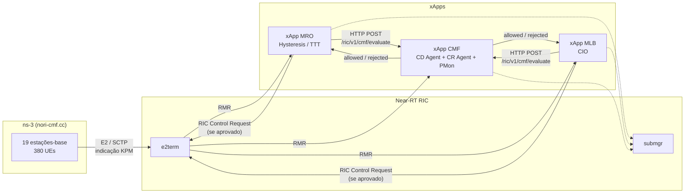

# O-RAN_CMF_NORI

**Conflict Mitigation Framework (CMF) for O-RAN, on top of NORI/ns-3.**

Este repositório reúne, em um único lugar, tudo o que é necessário para reproduzir o cenário de conflito entre xApps descrito em [`czezy/O-RAN_CMF_CM2023`](https://github.com/czezy/O-RAN_CMF_CM2023) e no artigo [Adamczyk & Kliks, *"Conflict Mitigation Framework and Conflict Detection in O-RAN Near-RT RIC"*, IEEE ComMag 2023](https://arxiv.org/abs/2305.07117), usando o módulo [NORI](https://github.com/lasseufpa/nori) do ns-3:

- uma simulação ns-3 (`nori-cmf.cc`) com 19 estações-base e 380 usuários, conectada de verdade a um Near-RT RIC via E2 — **sem** nenhuma lógica de conflito embutida, só o cenário de RAN;
- dois xApps OSC que competem pelo controle da fronteira de handover de cada célula — **MRO** (Mobility Robustness Optimization) e **MLB** (Mobility Load Balancing);
- um terceiro xApp, **xApp-CMF**, que implementa os três módulos do artigo — CD Agent (DCD + ICD), CR Agent e PMon (ImCD) — e é quem de fato detecta e mitiga os conflitos, rodando no Near-RT RIC como o artigo descreve, não embutido na simulação.

Nada aqui é um projeto novo do zero: são **patches** sobre dois projetos-base já existentes no ambiente OpenRAN@Brasil — o módulo `nori` do ns-3 e o xApp `xapp-nori`. Este README ensina exatamente onde aplicar cada patch e em que ordem.

## Sumário

- [Arquitetura](#arquitetura)
- [Estrutura deste repositório](#estrutura-deste-repositório)
- [Pré-requisitos](#pré-requisitos)
- [Passo a passo: clonar e aplicar os patches](#passo-a-passo-clonar-e-aplicar-os-patches)
  - [1. O módulo `nori-cmf` (ns-3)](#1-o-módulo-nori-cmf-ns-3)
  - [2. O xApp MRO](#2-o-xapp-mro)
  - [3. O xApp MLB](#3-o-xapp-mlb)
  - [4. O xApp CMF](#4-o-xapp-cmf)
- [Compilando o cenário ns-3](#compilando-o-cenário-ns-3)
- [Embarcando os xApps no Near-RT RIC](#embarcando-os-xapps-no-near-rt-ric)
- [Executando o cenário completo](#executando-o-cenário-completo)
- [Verificando se o CMF está detectando e mitigando conflitos](#verificando-se-o-cmf-está-detectando-e-mitigando-conflitos)
- [Problemas conhecidos](#problemas-conhecidos)
- [Referências](#referências)

## Arquitetura



Os três parâmetros disputados — `HOMeasurementOffset` (CIO), `HOHysteresis` e `HOTimeToTrigger` — entram juntos na mesma condição do evento de handover A3. O MLB escreve o primeiro para balancear carga; o MRO escreve os outros dois para reduzir ping-pongs e falhas de enlace. Como pertencem ao mesmo grupo funcional (`CellAffectHandoverBoundary`), decisões simultâneas dos dois xApps sobre a mesma célula são um **conflito indireto** — exatamente o tipo que o `xApp-CMF` foi construído para detectar e, dependendo do modo de prioridade configurado, mitigar **antes** de a decisão perdedora chegar à RAN: MRO e MLB consultam o CMF via HTTP a cada decisão, e só enviam o RIC Control Request se a resposta for `{"allowed": true}`.

`nori-cmf.cc` não participa dessa arbitragem — ele só aplica, sem questionar, qualquer decisão de controle que chegar via E2, de qualquer xApp. Toda a inteligência de detecção/mitigação vive no `xApp-CMF`, rodando no Near-RT RIC, como o artigo de referência propõe.

Para o detalhamento completo do modelo de rede, rádio e mobilidade, veja [`nori-cmf/docs/nori-cmf.md`](nori-cmf/docs/nori-cmf.md). Para o funcionamento interno de cada xApp, veja o `README.md` dentro de [`xapp-MRO/`](xapp-MRO/README.md), [`xapp-MLB/`](xapp-MLB/README.md) e [`xapp-CMF/`](xapp-CMF/README.md) (este último detalha DCD, ICD, ImCD e o protocolo `/ric/v1/cmf/evaluate`).

## Estrutura deste repositório

```
O-RAN_CMF_NORI/
├── nori-cmf/
│   ├── examples/
│   │   ├── nori-cmf.cc                    # o cenário de RAN (sem lógica de conflito)
│   │   └── CMakeLists.txt                 # registra o exemplo no build
│   ├── model/
│   │   ├── asn1c-types.cc / .h            # fix: RANParameterItem (double-free + m_id)
│   │   └── ric-control-message.cc         # fix: decodificação de ranParameters-List
│   ├── docs/nori-cmf.md                   # documentação completa do cenário
│   ├── run_nori_cmf.sh                    # script de execução
│   └── nori-cmf-examples-model.patch      # patch de examples/ e model/
├── xapp-MRO/
│   ├── ... (árvore completa do xApp já modificado)
│   └── xapp-MRO.patch                     # patch relativo ao xapp-nori original
├── xapp-MLB/
│   ├── ... (árvore completa do xApp já modificado)
│   └── xapp-MLB.patch                     # patch relativo ao xapp-nori original
└── xapp-CMF/
    ├── src/cd_agent.py                    # Conflict Detection Agent (DCD + ICD)
    ├── src/cr_agent.py                    # Conflict Resolution Agent
    ├── src/pmon.py                        # Performance Monitoring (ImCD)
    ├── ... (árvore completa do xApp)
    └── xapp-CMF.patch                     # patch relativo ao xapp-nori original
```

Cada diretório carrega **duas formas equivalentes** do mesmo conteúdo: a árvore de arquivos já pronta (para quem só quer copiar e usar) e um `.patch` (para quem prefere aplicar as mudanças sobre um clone limpo do projeto-base — a forma recomendada, porque preserva o histórico git de cada projeto). Este guia usa os `.patch`. Os três patches de xApp (`xapp-MRO.patch`, `xapp-MLB.patch`, `xapp-CMF.patch`) aplicam com `patch -p1`, o que funciona tanto com `git apply` quanto com o `patch` do GNU coreutils.

> **Nota sobre os links dentro de cada `README.md`/`nori-cmf.md`.** Esses arquivos são publicados aqui como uma cópia fiel do que fica em cada destino final depois do patch aplicado (`~/xapp-MRO`, `~/xapp-MLB`, `~/xapp-CMF`, `~/ns-3-dev/contrib/nori/docs`) — por isso, links relativos como `../ns-3-dev/...` ou `../../../xapp-CMF` são escritos para funcionar **depois** de aplicados, a partir do `$HOME` da VM, e não necessariamente ao navegar direto pelas pastas deste repositório. Siga o passo a passo abaixo antes de clicar nos links internos de cada README.


## Pré-requisitos

- Uma VM do [OpenRAN@Brasil Blueprint v1](https://github.com/LABORA-INF-UFG/openran-br-blueprint/wiki/OpenRAN@Brasil-Blueprint-v1), com `git`, `kubectl`, `docker` e `dms_cli` disponíveis;
- Um Near-RT RIC (namespace `ricplt`) já implantado e saudável — confira com `kubectl get pods -n ricplt` (todos os pods em `1/1` ou `2/2`);
- Um registry Docker local acessível em `127.0.0.1:5001` (já vem provisionado no blueprint);
- `git apply` (ou `patch`) disponível no `$PATH` — ambos já vêm no blueprint.

Todos os comandos abaixo assumem que você está no `$HOME` da VM (`~`, ou seja, `/home/openran-br` no ambiente de referência).

## Passo a passo: clonar e aplicar os patches

A ideia geral, repetida quatro vezes, é sempre a mesma: **clonar o projeto-base intocado e aplicar o patch por cima**. Nenhum dos quatro patches modifica os projetos originais — eles só adicionam o que falta para o CMF funcionar.

### 1. O módulo `nori-cmf` (ns-3)

O patch `nori-cmf-examples-model.patch` se aplica sobre o **módulo `nori`** que já vive dentro do seu checkout do ns-3, em `ns-3-dev/contrib/nori`. Se você ainda não tem esse módulo, clone-o primeiro:

```bash
cd ~/ns-3-dev/contrib
git clone https://github.com/lasseufpa/nori.git   # pule se contrib/nori já existir
```

Agora aplique o patch:

```bash
cd ~/ns-3-dev/contrib/nori
git apply ~/O-RAN_CMF_NORI/nori-cmf/nori-cmf-examples-model.patch
```

Isso faz três coisas:

1. adiciona `examples/nori-cmf.cc` — o cenário de RAN completo (19 células, emulação interna opcional de MRO/MLB para testes offline), **sem** nenhuma lógica de detecção/mitigação de conflito — essa parte foi deliberadamente removida daqui e vive inteira no `xApp-CMF` (passo 4);
2. registra o novo exemplo em `examples/CMakeLists.txt`, para o `./ns3 build` encontrá-lo;
3. corrige três bugs em `model/asn1c-types.{cc,h}` e `model/ric-control-message.cc` que, sem eles, fariam qualquer RIC Control Request de um xApp real ser silenciosamente ignorado (ou, em alguns casos, derrubar a simulação com um *double free*). Sem esse terceiro item, nenhum dos três xApps deste repositório consegue controlar as células — mesmo se estiverem rodando perfeitamente.

Confira que aplicou certo:

```bash
git status --short
#  M examples/CMakeLists.txt
#  M model/asn1c-types.cc
#  M model/asn1c-types.h
#  M model/ric-control-message.cc
# ?? examples/nori-cmf.cc
```

Por fim, copie o script de execução e a documentação para onde forem mais convenientes (o script espera rodar a partir de `~/ns-3-dev`):

```bash
cp ~/O-RAN_CMF_NORI/nori-cmf/run_nori_cmf.sh ~/ns-3-dev/
mkdir -p ~/ns-3-dev/contrib/nori/docs
cp ~/O-RAN_CMF_NORI/nori-cmf/docs/nori-cmf.md ~/ns-3-dev/contrib/nori/docs/
```

### 2. O xApp MRO

O patch `xapp-MRO.patch` se aplica sobre um clone **limpo** do [`xapp-nori`](https://github.com/LABORA-INF-UFG/xapp-nori), colocado no diretório `~/xapp-MRO`:

```bash
cd ~
git clone https://github.com/LABORA-INF-UFG/xapp-nori.git xapp-MRO
cd xapp-MRO
patch -p1 < ~/O-RAN_CMF_NORI/xapp-MRO/xapp-MRO.patch
```

O patch reescreve a lógica de controle (`src/custom_xapp.py`, `src/main.py`), remove o módulo de RL que não é usado aqui (`src/env.py`), renomeia a instância para `xappmro` em todos os manifests e scripts (`init/config-file.json`, `setup.py`, `update_xapp.sh`, `log_xapp.sh`, `resubscribe.sh`), reduz `src/requirements.txt` às dependências realmente usadas, e substitui o `README.md` por um guia dedicado ao MRO. A lógica de controle inclui uma chamada HTTP a `xapp-CMF` (`/ric/v1/cmf/evaluate`) antes de qualquer RIC Control Request — se o CMF rejeitar, a decisão simplesmente não é enviada nesse ciclo.

Confira:

```bash
git status --short
#  M README.md
#  M init/config-file.json
#  M install_influx_grafana.sh
#  M log_xapp.sh
#  M redeploy_ric.sh
#  M resubscribe.sh
#  M setup.py
#  M src/custom_xapp.py
#  D src/env.py
#  M src/main.py
#  M src/requirements.txt
#  M update_xapp.sh
```

### 3. O xApp MLB

Exatamente o mesmo procedimento, em um clone separado, com o patch do MLB:

```bash
cd ~
git clone https://github.com/LABORA-INF-UFG/xapp-nori.git xapp-MLB
cd xapp-MLB
patch -p1 < ~/O-RAN_CMF_NORI/xapp-MLB/xapp-MLB.patch
```

O MLB é o par funcional do MRO: mesma estrutura de patch, mesma lista de arquivos alterados, mesma consulta ao `xapp-CMF` antes de enviar controle — a diferença está inteiramente na lógica de decisão (`custom_xapp.py`), que aqui decide o `HOMeasurementOffset` (CIO) a partir da carga de PRBs da célula, em vez de Hysteresis/TTT.

> **Por que clones separados do mesmo repositório, em vez de um branch cada?** Porque `xapp-MRO`, `xapp-MLB` e `xapp-CMF` são publicados como três xApps OSC independentes — cada um com seu próprio nome (`xappmro`/`xappmlb`/`xappcmf`), sua própria imagem Docker e seu próprio `Chart`/instalação no RIC (`dms_cli onboard`/`install`). Diretórios de trabalho separados evitam qualquer chance de misturar as instalações.

### 4. O xApp CMF

Mesma base (`xapp-nori`), mesmo procedimento:

```bash
cd ~
git clone https://github.com/LABORA-INF-UFG/xapp-nori.git xapp-CMF
cd xapp-CMF
patch -p1 < ~/O-RAN_CMF_NORI/xapp-CMF/xapp-CMF.patch
```

Além das mesmas mudanças de infraestrutura (nome `xappcmf`, `requirements.txt` enxuto, `README.md` próprio, remoção de `src/env.py`), este patch **adiciona** três arquivos novos que não existem em nenhum outro xApp deste projeto:

- `src/cd_agent.py` — Conflict Detection Agent: DCD (conflito direto) + ICD (conflito indireto), ambos *pre-action*;
- `src/cr_agent.py` — Conflict Resolution Agent: resolve com prioridade estática (`none`, `prioMRO` ou `prioMLB`, configurável em `custom_xapp.py`);
- `src/pmon.py` — Performance Monitoring, alimentando a detecção implícita (ImCD), *post-action*.

`src/custom_xapp.py` expõe `POST /ric/v1/cmf/evaluate`, o endpoint que MRO e MLB consultam antes de cada decisão de controle — veja [`xapp-CMF/README.md`](xapp-CMF/README.md) para o protocolo completo.

## Compilando o cenário ns-3

Com o patch do `nori-cmf` aplicado (passo 1), compile o módulo:

```bash
cd ~/ns-3-dev
./ns3 build nori-cmf
```

Na primeira vez que qualquer parte do módulo `nori` for tocada, o `ns3 build` (sem argumento) recompila o módulo inteiro — pode levar alguns minutos. Builds seguintes, tocando só em `nori-cmf.cc`, são rápidos.

Teste rapidamente em modo *offline* (sem depender do RIC — útil para confirmar que o build está saudável antes de mexer com Kubernetes):

```bash
./ns3 run "nori-cmf --useE2=0 --simTime=30"
```

Se aparecer o resumo `NORI CMF summary` no final, o build está correto. Repare que, sem `xapp-CMF` (que só existe no caminho E2), este modo sempre se comporta como o baseline "CM disabled" do artigo — nada mitiga os conflitos entre a emulação interna de MRO e MLB.

## Embarcando os xApps no Near-RT RIC

Com o RIC saudável (`kubectl get pods -n ricplt`), instale os três xApps. **Instale o `xapp-CMF` antes, ou junto com, o MRO/MLB** — enquanto ele estiver ausente, MRO e MLB continuam funcionando (a chamada HTTP falha aberta), mas nenhum conflito é de fato mitigado, só a decisão isolada de cada xApp:

```bash
cd ~/xapp-CMF && bash update_xapp.sh
cd ~/xapp-MRO && bash update_xapp.sh
cd ~/xapp-MLB && bash update_xapp.sh
```

Cada `update_xapp.sh` faz o ciclo completo sozinho: onboard do chart via `dms_cli`, build da imagem Docker, push para `127.0.0.1:5001`, e instalação no namespace `ricxapp`. Na primeira execução de cada um, o build da imagem baixa e compila `rmr`, clona o `ric-plt-xapp-frame-py` e instala as dependências Python — espere alguns minutos; execuções seguintes reaproveitam o cache de camadas do Docker (a segunda e terceira imagem, construídas logo em seguida, costumam ser rápidas).

```bash
kubectl get pods -n ricxapp
# ricxapp-xappcmf-... 1/1 Running
# ricxapp-xappmro-... 1/1 Running
# ricxapp-xappmlb-... 1/1 Running
```

Cada `xapp-*/README.md` traz um roteiro passo a passo bem mais detalhado desta etapa, incluindo diagnóstico de `CrashLoopBackOff` e de reinícios inesperados — vale a leitura antes de rodar em um cluster que você não conhece bem.

## Executando o cenário completo

Com os três xApps já `1/1 Running`, descubra o IP do pod `e2term` e suba a simulação em modo E2:

```bash
E2TERM_IP=$(kubectl get pods -n ricplt -o wide | grep e2term-alpha | awk '{print $6}')
cd ~/ns-3-dev
./ns3 run "nori-cmf --useE2=1 --ipE2TermRic=$E2TERM_IP"
```

As 19 células devem completar o E2-SETUP com o RIC (`[INFO ] [SCTP] Sent E2-SETUP-REQUEST` no log da simulação; `CONNECTED` nos logs do `e2mgr`).

Como os xApps normalmente já estavam rodando **antes** dessas 19 células existirem, é preciso pedir a eles para procurar de novo os nós E2 disponíveis:

```bash
CMF_IP=$(kubectl get svc -n ricxapp service-ricxapp-xappcmf-http -o jsonpath='{.spec.clusterIP}')
MRO_IP=$(kubectl get svc -n ricxapp service-ricxapp-xappmro-http -o jsonpath='{.spec.clusterIP}')
MLB_IP=$(kubectl get svc -n ricxapp service-ricxapp-xappmlb-http -o jsonpath='{.spec.clusterIP}')
curl "http://$CMF_IP:8080/ric/v1/resubscribe"
curl "http://$MRO_IP:8080/ric/v1/resubscribe"
curl "http://$MLB_IP:8080/ric/v1/resubscribe"
```

(Os scripts `bash resubscribe.sh` dentro de cada diretório do xApp fazem a mesma coisa, resolvendo o Service automaticamente.) A resposta HTTP volta imediatamente — a resubscrição de fato roda em segundo plano dentro do pod (veja [Problemas conhecidos](#problemas-conhecidos) sobre o tempo que isso pode levar).

## Verificando se o CMF está detectando e mitigando conflitos

O jeito mais direto de confirmar que o `xapp-CMF` está funcionando, sem depender do ciclo de resubscrição terminar a tempo, é chamar `/ric/v1/cmf/evaluate` diretamente:

```bash
CMF_IP=$(kubectl get svc -n ricxapp service-ricxapp-xappcmf-http -o jsonpath='{.spec.clusterIP}')

curl -s -X POST http://$CMF_IP:8080/ric/v1/cmf/evaluate \
  -d '{"source":"MRO","cellId":20,"parameterId":2,"value":1.5}'
# {"allowed": true}

curl -s -X POST http://$CMF_IP:8080/ric/v1/cmf/evaluate \
  -d '{"source":"MLB","cellId":20,"parameterId":1,"value":3.0}'
# {"allowed": false, "reason": "ICD indirect conflict with MRO's 'HOHysteresis'=1.5 on cell 20 (prioritized: MRO)"}
```

A segunda chamada propõe uma mudança de CIO na mesma célula em que o MRO acabou de mudar a Hysteresis — um conflito indireto estrutural (mesmo grupo `CellAffectHandoverBoundary`) — e é corretamente rejeitada, com o modo de prioridade padrão (`prioMRO`). Confira o registro em `kubectl logs` do `xapp-CMF` e em `/tmp/conflicts.json` dentro do pod (`kubectl exec ... -- cat /tmp/conflicts.json`).

Para ver o laço fechado de verdade, com decisões vindas da simulação, acompanhe os logs do MRO ou do MLB:

```bash
kubectl logs -n ricxapp -f $(kubectl get pods -n ricxapp | grep xappmro | awk '{print $1}') | grep "Cell NRCellDU"
```

Uma decisão real, aprovada pelo CMF e aplicada, tem esta cara — repare que o `(was ...)` de uma linha bate com o valor que a linha *anterior*, para a mesma célula, mandou aplicar:

```text
Cell NRCellDU_12: ho=11 pp_ratio=27.3% rlf_ratio=9.1% -> hysteresis=1.0dB ttt=0.1s (was hysteresis=1.0 ttt=0.08)
Cell NRCellDU_12: ho=12 pp_ratio=25.0% rlf_ratio=8.3% -> hysteresis=1.0dB ttt=0.08s (was hysteresis=1.0 ttt=0.1)
```

Isso confirma o laço completo: a decisão do xApp foi aprovada pelo `xapp-CMF`, saiu como RIC Control Request, foi decodificada e aplicada pelo `nori-cmf.cc` (graças às correções do passo 1), e voltou refletida na indicação KPM seguinte. Os mesmos valores também aparecem no CSV que a própria simulação grava (`<outputDir>/bs-12.csv`, colunas `hyst`/`ttt`, ou `cio` para o MLB) — útil para conferência cruzada sem depender dos logs do xApp.

## Problemas conhecidos

- **`e2term` pode crashar ao final de uma simulação.** Quando o `nori-cmf` termina, as 19 conexões SCTP fecham quase ao mesmo tempo; isso expõe um bug pré-existente no `e2term` do RIC (`free(): invalid pointer`, não relacionado a este repositório) que derruba o pod com alguma frequência. O Kubernetes reinicia o pod sozinho em 1–2 minutos — espere `kubectl get pods -n ricplt` mostrar `1/1` de novo antes de rodar outra simulação.
- **Resubscrição pode demorar em clusters com histórico.** `bash resubscribe.sh` retorna imediatamente (o trabalho roda em segundo plano dentro do pod), mas, se o RIC acumulou muitos registros de gNBs antigos/obsoletos ao longo do tempo (comum depois de várias rodadas de teste), o ciclo completo de cancelar+recriar assinaturas pode levar vários minutos — em testes com um cluster bastante usado, chegou a não terminar dentro da janela de uma simulação de ~2 minutos. Isso afeta MRO, MLB e CMF igualmente (todos os três sofrem do mesmo padrão de assinatura). Não é motivo para achar que algo está quebrado: use a verificação direta via `/ric/v1/cmf/evaluate` (seção anterior) para confirmar que o CMF em si está saudável, independentemente de quanto da resubscrição já terminou.
- **Cuidado ao dar `git pull` neste repositório com alterações locais não commitadas.** Se houver mudanças pendentes (por exemplo, geradas por uma sessão anterior deste mesmo projeto) e o histórico remoto tiver divergido, um `git pull` pode gerar conflitos de merge; se resolvidos incorretamente (ou commitados sem resolver), os marcadores `<<<<<<<`/`=======`/`>>>>>>>` acabam parando dentro dos arquivos versionados — inclusive em código C++/Python, quebrando o build. Antes de um `git pull`, rode `git status` e `git stash` (ou commit) qualquer alteração pendente; depois do pull, é boa prática rodar `grep -rn "^<<<<<<< \|^=======$\|^>>>>>>> "` na árvore para confirmar que nada ficou malresolvido.

O `README.md` de cada xApp traz uma seção de troubleshooting mais completa, incluindo como diagnosticar `CrashLoopBackOff` e reinícios por falha do *liveness probe* (exit code 137).

## Referências

- Framework de mitigação de conflitos: [Adamczyk & Kliks, "Conflict Mitigation Framework and Conflict Detection in O-RAN Near-RT RIC", IEEE ComMag 2023](https://arxiv.org/abs/2305.07117)
- Especificação do cenário e material suplementar: [`czezy/O-RAN_CMF_CM2023`](https://github.com/czezy/O-RAN_CMF_CM2023)
- Módulo NORI: [`lasseufpa/nori`](https://github.com/lasseufpa/nori)
- xApp base: [`LABORA-INF-UFG/xapp-nori`](https://github.com/LABORA-INF-UFG/xapp-nori)
- Documentação completa do cenário: [`nori-cmf/docs/nori-cmf.md`](nori-cmf/docs/nori-cmf.md)
- 3GPP TR 38.901 (modelo de canal UMa) e TS 38.331 (parâmetros de handover: CIO, histerese, TTT)
